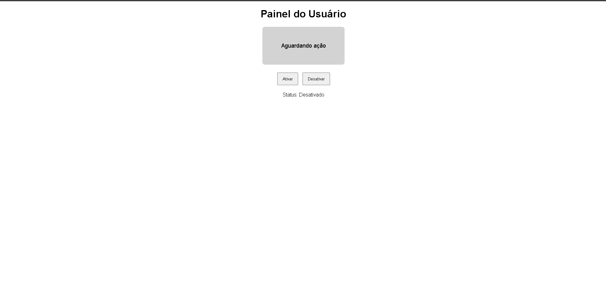
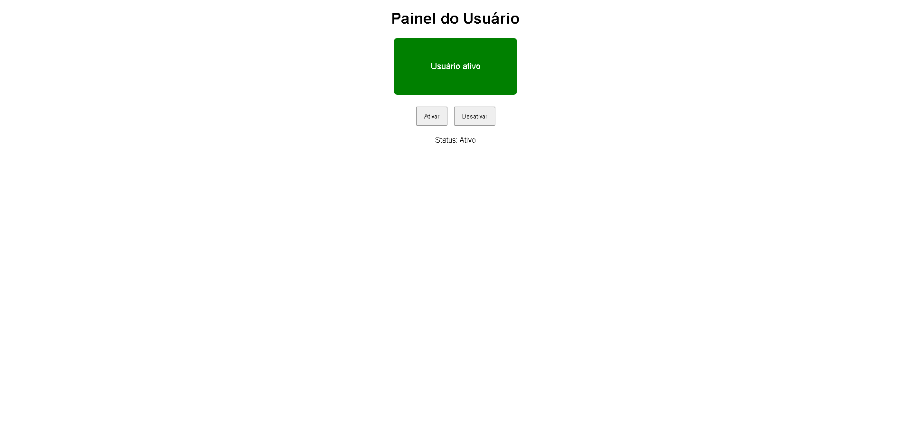

# 🖥️ Painel Interativo com JavaScript

Projeto desenvolvido para praticar **JavaScript**, **manipulação do DOM** e **eventos**, durante os estudos em **Análise e Desenvolvimento de Sistemas (ADS)**.

---

## 📌 Funcionalidades

- Alteração dinâmica de textos
- Mudança de estilos com JavaScript
- Interação com botões
- Eventos de mouse (entrar e sair)
- Organização de código em HTML, CSS e JS

---

## 🛠️ Tecnologias Utilizadas

- HTML5
- CSS3
- JavaScript (DOM)

---

## 🖼️ Demonstração

### Painel inicial

### Painel em interação

---

## 📂 Estrutura do Projeto
Listagem de caminhos de pasta para o volume Windows
O n·mero de sÚrie do volume Ú 80E3-7519
C:.
|   estrutura.txt
|   index.html
|   README.md
|   script.js
|   style.css
|   
\---assets
        painel-ativo.png
        painel-inicial.png        